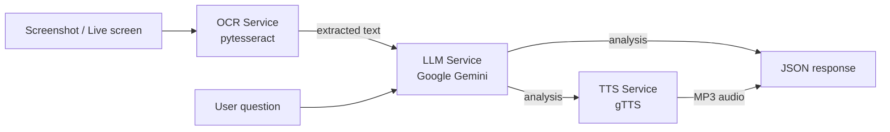

<div align="center">

# 🖥️ Dynamic Screen Companion

**A real-time, multi-modal AI assistant that sees your screen, understands it, and talks back.**

Upload (or capture) a screenshot → it reads the screen with **OCR**, reasons about it with **Google Gemini**, and **speaks** the answer back to you.

[](https://github.com/amitmohanty022/dynamic-screen-companion/actions)


</div>

---

## ✨ What it does

Dynamic Screen Companion turns any screenshot into an interactive, hands-free assistant. Point it at an error message, a dense document, a dashboard, or a form, and it explains what you're looking at and answers your questions — out loud.

- 👁️ **Reads the screen** — extracts on-screen text using OCR (Tesseract)
- 🧠 **Understands it** — sends the context to Google Gemini for reasoning and Q&A
- 🔊 **Speaks back** — synthesises a natural spoken reply (gTTS)
- ⚡ **Two interfaces** — a REST API (FastAPI) for integration, and a Streamlit web app for humans
- 🛟 **Runs anywhere** — every external dependency has a graceful fallback, so it works **out of the box without an API key** (mock mode)

> Built as an end-to-end, production-style multi-modal pipeline — not a notebook. Modular services, tests, CI, and Docker included.

---

## 🎬 Demo

| Interface | How to launch |
|-----------|---------------|
| 🌐 **Web demo (Streamlit)** | `streamlit run demo/streamlit_app.py` |
| 🚀 **REST API (FastAPI)** | `uvicorn app.main:app --reload` → open `http://localhost:8000/docs` |

> **Live demo:** deploy the Streamlit app free on [Hugging Face Spaces](https://huggingface.co/spaces) (SDK: *Streamlit*, point it at `demo/streamlit_app.py`) and drop the link here.

<!-- Add a screen recording / GIF here once deployed:

-->

---

## 🏗️ Architecture



The codebase is intentionally modular — each stage is an isolated, independently testable service with a fallback. Full write-up in [`docs/architecture.md`](docs/architecture.md).

```
dynamic-screen-companion/
├── app/
│   ├── main.py              # FastAPI app & orchestration
│   ├── config.py            # env-driven settings
│   ├── schemas.py           # request/response models
│   └── services/
│       ├── ocr.py           # screen text extraction
│       ├── gemini_client.py # LLM reasoning (+ mock fallback)
│       ├── tts.py           # text-to-speech
│       └── screen_capture.py# live monitor capture (local)
├── demo/streamlit_app.py    # interactive web demo
├── tests/                   # pytest suite (runs without a key)
├── docs/architecture.md
├── Dockerfile
└── .github/workflows/ci.yml
```

---

## 🚀 Quickstart

### 1. Clone & install
```bash
git clone https://github.com/amitmohanty022/dynamic-screen-companion.git
cd dynamic-screen-companion
python -m venv .venv && source .venv/bin/activate
pip install -r requirements.txt
```

### 2. (Optional) add your Gemini key
Without a key the app runs in **mock mode**. For live AI responses:
```bash
cp .env.example .env
# edit .env and set GEMINI_API_KEY=...   (free key: https://aistudio.google.com/app/apikey)
```
For OCR, install the Tesseract engine (`brew install tesseract` / `apt-get install tesseract-ocr`).

### 3. Run the API
```bash
uvicorn app.main:app --reload
```
Then open the interactive docs at **http://localhost:8000/docs**.

### 4. Or run the web demo
```bash
streamlit run demo/streamlit_app.py
```

---

## 🔌 API reference

| Method | Endpoint | Description |
|--------|----------|-------------|
| `GET`  | `/health` | Service status + capabilities |
| `POST` | `/analyze` | Upload an image (+ optional question) → analysis (+ audio) |
| `POST` | `/capture` | Capture the host's screen (local desktop only) |

**Example**
```bash
curl -X POST http://localhost:8000/analyze \
  -F "file=@screenshot.png" \
  -F "question=What does this error mean?" \
  -F "speak=false"
```

```json
{
  "extracted_text": "Traceback (most recent call last): ...",
  "analysis": "This is a Python ZeroDivisionError ...",
  "question": "What does this error mean?",
  "ocr_available": true,
  "llm_mode": "gemini",
  "audio_base64": null
}
```

---

## 🐳 Docker

```bash
docker build -t dynamic-screen-companion .
docker run -p 8000:8000 -e GEMINI_API_KEY=your_key dynamic-screen-companion
```

---

## ✅ Tests & quality

```bash
pip install -r requirements-dev.txt
pytest -q          # full suite runs in mock mode — no API key needed
ruff check app tests
```
CI runs linting + tests on every push via GitHub Actions.

---

## 🧰 Tech stack

**Python · FastAPI · Google Gemini · Tesseract OCR · gTTS · Streamlit · Docker · Pytest · GitHub Actions**

---

## 🗺️ Roadmap

- [ ] Live continuous capture mode with frame-diffing to reduce API calls
- [ ] Streaming responses (Server-Sent Events)
- [ ] Local LLM option (Ollama) for fully offline use
- [ ] Multi-language OCR + speech
- [ ] Browser extension client

---

## 👤 Author

**Amit Kumar Mohanty** — AI / ML Engineer
[GitHub](https://github.com/amitmohanty022) · [LinkedIn](https://linkedin.com/in/amitkrmohanty)

## 📄 License

Released under the [MIT License](LICENSE).
