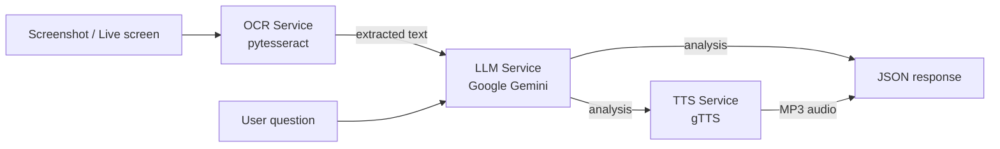

# Architecture

Dynamic Screen Companion is a small, modular multi-modal pipeline. Each stage is
an independent service with a graceful fallback, so the system stays runnable
even when an external dependency (Gemini key, Tesseract binary, network) is
missing.

## Pipeline

## Components

| Layer | Module | Responsibility | Fallback |
|-------|--------|----------------|----------|
| API | `app/main.py` | FastAPI routes, request validation, orchestration | — |
| Config | `app/config.py` | Env-driven settings, `.env` loader | sensible defaults |
| OCR | `app/services/ocr.py` | Extract text from images | returns `""` if Tesseract absent |
| LLM | `app/services/gemini_client.py` | Reason over screen text | deterministic mock if no API key |
| TTS | `app/services/tts.py` | Speak the response | returns `None` if offline |
| Capture | `app/services/screen_capture.py` | Grab a live monitor (local) | clear error when headless |
| Demo | `demo/streamlit_app.py` | Interactive web UI | runs in mock mode |

## Design principles

- **Graceful degradation** — every external dependency is optional; the app
  never hard-crashes because a key or binary is missing.
- **Separation of concerns** — the orchestration layer (`main.py`) knows nothing
  about *how* OCR or the LLM work, only their interfaces.
- **Testable in isolation** — services are pure functions where possible, so the
  test suite runs without credentials or a display.
- **Two entry points, one core** — a REST API (for integration) and a Streamlit
  demo (for humans) share the same service layer.

## Request flow (`POST /analyze`)

1. Client uploads an image (+ optional question).
2. `ocr.extract_text` converts pixels to text.
3. `gemini_client.analyze` builds a prompt and queries Gemini (or mock).
4. `tts.synthesize` optionally renders the answer to MP3.
5. The API returns extracted text, analysis, mode and base64 audio.
